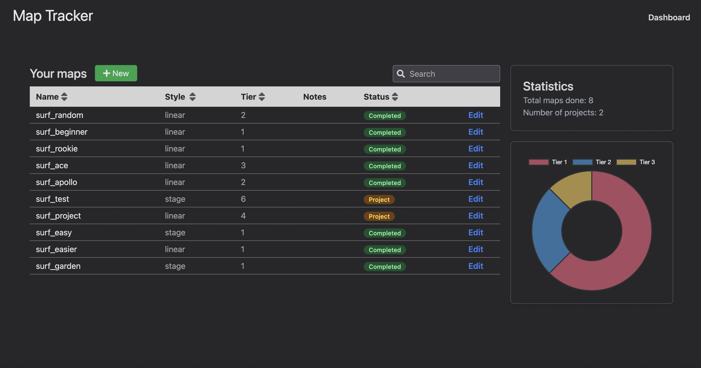

<h1 align="center">
  Map tracker
</h1>

<div align="center">

 


</div>

## Introduction

Map tracker for Counter-Strike surf mode. Track your completed maps and projects.



## Installation

1.Install npm packages

```bash
$ cd node-express/
$ npm install
$ cd ..
$ cd angular-frontend/
$ npm install
```

2.Create your own .env file in `node-express` folder. Check in `.env-sample` for a sample.

## Open with docker

Clone this repo and then do `docker-compose up --build`. When build is ready open port `80` and you should see the project.

## Technologies used

- Angular
- TypeScript
- Tailwind
- Node
- Express
